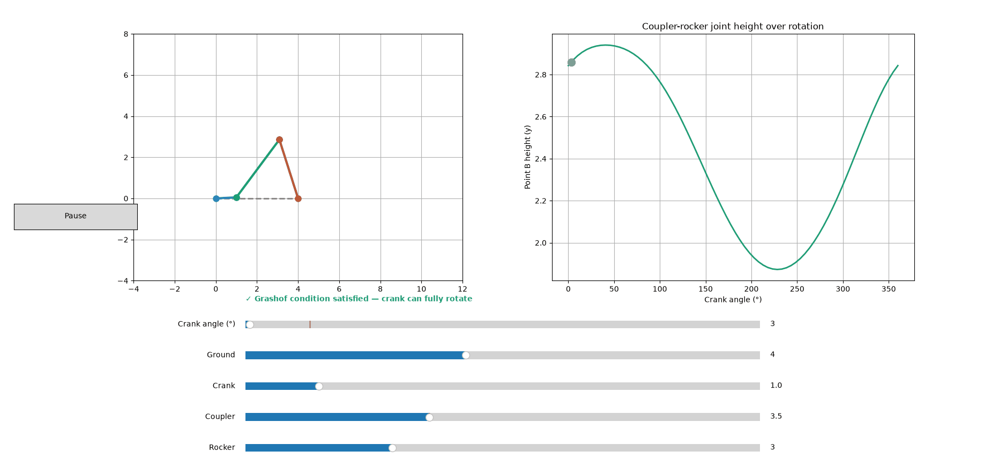
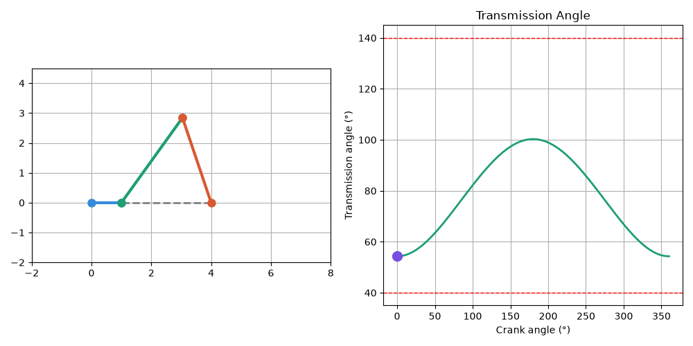

# LinkSim

A Python-based interactive tool for analysing the kinematics and mechanical behaviour of four-bar linkages. LinkSim combines numerical position solving, mechanism classification, geometric feasibility checks, transmission-angle analysis, and interactive visualisation to explore how changes in link dimensions and crank position affect mechanism behaviour.



## What it does

- Solves the vector loop equations for a planar four-bar linkage numerically (`scipy.optimize.fsolve`), given the crank angle and four link lengths
- Sweeps through a full 360° rotation to compute the resulting motion of every joint
- Checks Grashof's condition to confirm whether the crank can fully rotate
- Calculates the **transmission angle** at every point in the cycle — a standard mechanism-design metric indicating how efficiently force is transmitted through the linkage, and flags when it falls outside the commonly-used 40°–140° "safe" range

<p align="center">
  
</p>


- Animates the linkage alongside a live-updating transmission angle graph
- Includes an **interactive explorer** (`interactive.py`) with sliders for all four link lengths and the crank angle, live Grashof feedback, geometric feasibility checking, auto-rotate play/pause, and a live graph of the coupler-rocker joint's vertical motion through the cycle

## Why

I built LinkSim as a way to explore mechanism design through computation. Rather than relying entirely on CAD models and trial-and-error adjustments, the aim is to understand how link lengths and input motion affect the behaviour of a four-bar linkage before committing to a physical design.

The project started as a way to strengthen my understanding of kinematics, numerical solving, and mechanism analysis, while building something that could be used to investigate real engineering design problems.


## Running it

```bash
git clone https://github.com/AzlanL/LinkSim.git
cd LinkSim
python -m venv venv
venv\Scripts\activate          # Windows
pip install -r requirements.txt

python linkage.py        # animated linkage + transmission angle
python interactive.py    # interactive explorer with sliders
python make_gif.py       # regenerates linkage_demo.gif
```

## How it works

The four-bar linkage is solved using the vector loop equation — treating each link as a vector, the four links must sum to zero to form a closed loop:

crank + coupler − rocker − ground = 0

Given the crank angle (the input), this is solved numerically for the coupler and rocker angles using `scipy.optimize.fsolve`, since the equations are transcendental and can't be solved algebraically.

## Known limitations

- Extreme slider combinations in `interactive.py` can produce geometrically invalid configurations (flagged with a warning) or linkages that don't satisfy Grashof's condition, meaning the crank can't fully rotate
- The 40°/140° transmission angle threshold is a commonly used engineering rule of thumb, not a strict physical limit